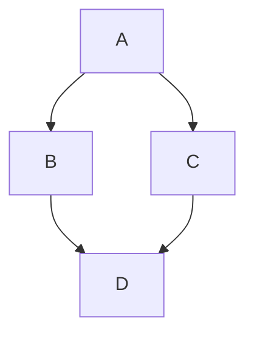

# Mermaid for AgentRQ

Draws ```mermaid blocks in tasks and messages as diagrams, with a toggle back to
the text.

````markdown

````

Every diagram carries a **Text** / **Diagram** toggle, so the source is always
one click away — which matters, because a diagram is written by hand and the
text is what you need in order to fix it.

## Installing

Extensions are a desktop feature. In the AgentRQ desktop app:

**Extensions → Install from folder**, then pick this repository.

It asks for **no permissions at all** — no workspace tools, no account tools, no
network. It is handed the text of a fenced block and answers with a diagram; it
reads nothing else. The install screen shows no permission list, only the
sentence AgentRQ puts on every install about extensions running with full access
to your computer.

Requires AgentRQ 0.5 or newer.

## Settings

| Setting | Default | What it does |
|---|---|---|
| Only these workspaces | blank | Comma-separated workspace ids. Blank draws diagrams everywhere; a list draws them in those workspaces and nowhere else. |
| Largest diagram to draw | 400 lines | A diagram longer than this is left as text. The parser runs in the window you are reading in. |

## What this extension does, and does not, do

**It does not draw anything.** It answers with the diagram's *source*, and
AgentRQ draws it.

That is the design rather than a shortcut. AgentRQ's renderer runs on a
privileged origin with a bridge to files, the clipboard and the shell — so no
extension is ever allowed to hand back markup, and this one is no exception. The
contract is the same as every other surface: extensions describe, AgentRQ
renders.

What is left is policy, and there is real policy to have:

- **which workspaces** diagrams are drawn in,
- **how large** a diagram is worth drawing,
- and **refusing sources that reconfigure the renderer**.

### `%%{init: ...}%%` is refused

Mermaid reads configuration out of the diagram source, and one of the things it
can set is `securityLevel` — so a diagram could otherwise turn off mermaid's own
escaping from inside the text being drawn. AgentRQ already initialises mermaid
with `securityLevel: 'strict'` and `htmlLabels: false`; this refuses the
directive as well.

Two guards that fail differently: one is configuration that a later refactor
could change, the other is a rule with a test on it.

A refused diagram is **not** an error. The block stays as the text it was, which
is exactly what somebody needs in order to see what is wrong with it.

## Where a diagram comes from

Usually not from the person reading it. A mermaid block in AgentRQ was typically
written by an agent, or pasted out of an issue, or assembled from a webhook
payload. That is why the source is refused rather than sanitised, why mermaid is
configured before it can be asked to draw, and why the SVG it produces goes
through DOMPurify before reaching the page — `foreignObject`, the element that
embeds arbitrary HTML inside an SVG, is removed there.

## Developing

```bash
npm install
npm test
npm run test:coverage   # gates at 100%, the same bar AgentRQ holds
```

Installed from a folder, the install is **linked** — editing this directory
edits the installed extension, so a change is one reload away.

## Licence

Apache 2.0. See [LICENSE](LICENSE).
